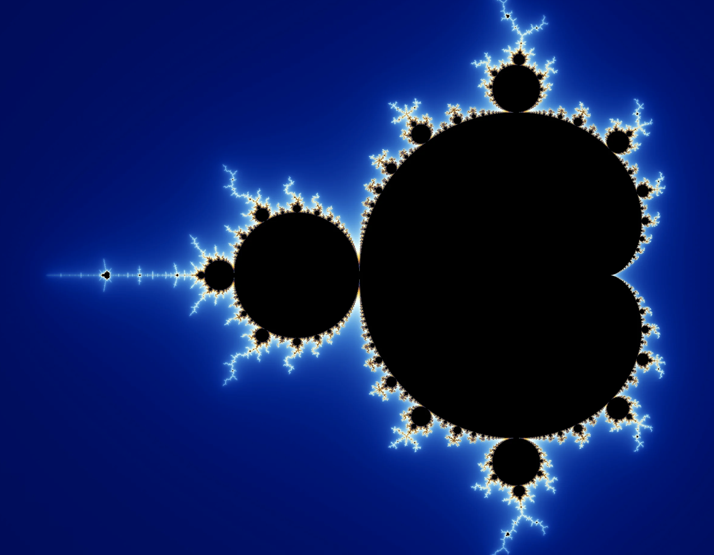

# Fractals

# Fractals:
#### Authored by: [Guru](https://github.com/mahaguru24), [Alex](https://github.com/alexliu101), [Niccolo](https://github.com/niccolomerlatti) and [Abdul](https://github.com/abzmalch95)

---
## About
In our project we aim to make NFTs from pieces of fractal using python, attaching them as certificates and auctioning them on the blockchain.
In mathematics, fractal is a term used to describe geometric shapes containing shapes detailed structure at arbitrarily small scales, In lehmann terms fractals can be thought of as never-ending patterns made of smaller patterns in on a small scale.
---
